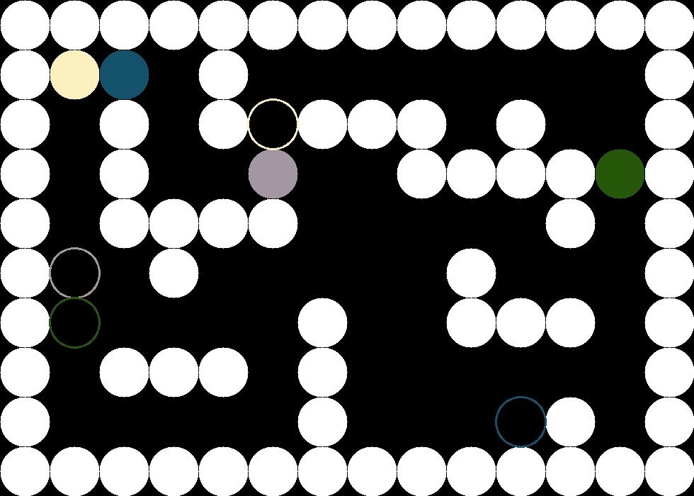

# CppND-Concurrent-Route-Planning-Simulation

Multithreading application for parallel planning and navigation using C++ with CMake

## Dependencies for Running Locally
* cmake >= 2.8
  * All OSes: [click here for installation instructions](https://cmake.org/install/)
* make >= 4.1 (Linux, Mac), 3.81 (Windows)
  * Linux: make is installed by default on most Linux distros
  * Mac: [install Xcode command line tools to get make](https://developer.apple.com/xcode/features/)
  * Windows: [Click here for installation instructions](http://gnuwin32.sourceforge.net/packages/make.htm)
* OpenCV >= 4.1
  * The OpenCV 4.1.0 source code can be found [here](https://github.com/opencv/opencv/tree/4.1.0)
* gcc/g++ >= 5.4
  * Linux: gcc / g++ is installed by default on most Linux distros
  * Mac: same deal as make - [install Xcode command line tools](https://developer.apple.com/xcode/features/)
  * Windows: recommend using [MinGW](http://www.mingw.org/)

## Basic Build Instructions

1. Clone this repo.
2. Make a build directory in the top level directory: `mkdir build && cd build`
3. Compile: `cmake .. && make`
4. Run it: `./Concurrent_Route_Planning_Simulation`.

## About The Project

This application is build on my own. However, I am re-using some algorithms and code parts from the previous C++ Nanodegree projects, such as the AStar implementaion.

### Description
This application is about the planning and navigation of multiple turtles simultaneously  in a custom map with static obstacles. The turtles are getting random destination coordinates in the map and are supposed to find the shortest route from the starting position to its defined destination. The path must be calculated  in a way that the turtles doesn't collide with each other and doesn't collide with the obstacles.
Once a turtle reaches its destination, a new destination will be defined.

### File and Class Structure
For this application the following four classes are defined (header files) and implemented (source files).
-   **Graphic:** The Graphic object provides functions to display the world with the map and the turtles. It also visualizes the calculated routes and destination points for each turtle.
-   **Map:** The Map object is holding the actual grid/map that is loaded from a custom text file. In addition the class provides functions to safely access the map and to reserve and free routes in the map.   
-   **Turtle:** The Turtle object is used to represent a turtle and to control a turtle in the map. The class is designed in way that each Turtle object can be started in individual threads to allow concurrent turtle traffic.
-   **AStar:** The AStar class provides functions to calculate the shortest route from an initial position to the target position

All header and source files are located in the src/ folder of the top level project directory

### Program Flow
- The main thread is supposed to create the shared map handle and to spawn the turtles. Therefor each turtle is spawned in a individual thread and gets passed the shared map handle. In addition the main thread is responsible create the world graphics and afterwards to update the graphics such as the turtle's positions and destinations as well as the routes, in an infinite loop.
- Each turtle thread is continuously 1) setting a new destination 2) planning the route to the destination (by using the AStar class) and 3) executing step by step to reach the destination
